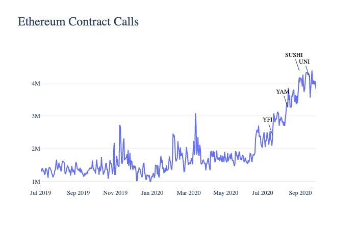

# 5. Market Overview

With the of know-your-customer (KYC) and anti-money laundering (AML) trends in the banking industry somewhat starting to be reflected in the regulation of cryptocurrencies in areas that are sometimes unnecessary, users are exposed to look for alternative ways to preserve unconditional privacy. In the quest to retain anonymity, privacy, and security, it is important to understand that typical wallets are challenged at best to protect one’s wealth and data against third parties. Naturally, there is an increasing demand for privacy-oriented wallets to defend against transactions being followed by bad actors. 

The growing sentiment regarding privacy was also reiterated with the boom of DeFi applications in the summer of 2020. As the majority of DeFi platforms were built on Ethereum, the graph below shows how the launch of 4 DeFi tokens - YFI, YAM, SUSHI, and UNI - corresponded to the Ethereum smart contract calls. 

[_Source: Coin Metrics Network Data Pro_](https://coinmetrics.io/cm-network-data-pro/)

Clearly, both the public’s shift towards privacy-based solutions and the rise of DeFi are reflective of the favourable conditions for the Blank wallet. We rather conservatively estimate the **Total Addressable Market of $3.03B** as of Q1 2021 and expect the growth of the market to continue over the next 3-5 years. The next sections will provide an overview of our competitors and potential opportunities for growth and expansion. 

## 5.1. Direct Competition

Our direct competition extends to platforms enabling private deposits of Ethereum by using smart contracts (such as Tornado Cash), anonymous wallets (such as Incognito), or even private, but not anonymous wallets (such as Metamask). The success of our competitors reassures that the demand for privacy-based transactions is as high as ever - though we also see clear competitive advantages that Blank brings to the market. 

[Tornado Cash](https://tornado.cash/) has partially satisfied the demand for the anonymous and private transactions using smart contracts as showcased by its 466,173 ETH lifetime deposits - roughly $790,000,000 worth of deposits at today’s prices. However, we have observed inefficiencies due to the less user-friendly deposit system that requires manual, high-maintenance participation of the user. Also, we see untapped user growth potential by employing more aggressive marketing programs, which Tornado Cash has not done. 

[Incognito Wallet](https://incognito.org/) is another wallet that relies on zero-knowledge proof - one of the only provable ways to make something entirely untrackable. The wallet has executed $45,000,000 lifetime deposits, not including the volumes of its trading platform. The criticism of Incognito comes back to the lack of user-friendliness (especially for the less experienced) and lengthy deposit process. 

Finally, having racked up more than 1M+ users on Google Chrome in under a year, [Metamask](https://metamask.io) has become an active player in the Ethereum community. While it has an inbuilt Privacy Mode, its functionality is limited: users nonetheless reveal their Wallet ID while using the platform. 

With that being said, Blank is working towards combining all the good and limiting the bad from its peers. In the table below, we have critically evaluated the capabilities of our direct competitors and how we improve upon what already works. 

| Feature | Blank | Metamask | Tornado.Cash |
| --- | --- | --- | --- |
| Hidden History | Yes | No | Yes |
| 0 User Tracking | Yes | No | Yes |
| Browser Extension Wallet | Yes | Yes | No |
| Web3 ready for all DeFi applications | Yes | Yes | No |
| ERC-20 Support | Yes | Yes | Only 4 stablecoins |
| Partial Withdraw | Yes | Yes | No |
| Automatic Smart Contract Deposits | Yes | No | No |
| Referral system | Yes | No | No |
| Revenue Sharing | Yes | No | No |

## 5.2. Untapped Markets

The yet untapped opportunities for Blank cannot be separated from the DeFi boom. We think that the recent rise in the public interest did not happen by chance - it is a reflection of a major shift towards privacy-based solutions. Thus, presuming a 5% of the current TVL of $16.51B in DeFi would agree to increase their privacy and anonymity, a computed dollar value would result in a ~$1,100,000,000 market size. As the trust in DeFi shows more and more strength, Blank is looking to be one of the main supporting mechanisms and beneficiaries from DeFi’s growth. 

Another emerging opportunity for Blank is becoming a go-to service for those that were left unserved due to the struggles of privacy coins. Clearly, monero, zcash or dash were an effective privacy solution for quite some time - but the regulators have caught up. Major exchanges [were forced to delist these privacy coins to comply with KYC and AML standards](https://www.coindesk.com/bittrex-to-delist-privacy-coins-monero-dash-and-zcash), thus severely limiting both liquidity and usability of such coins. We think that Blank is in a perfect position to deliver anonymous transactions - and with seemingly no hassle compared to privacy coins.

## 5.3. Indirect Competition

Although it may seem like a stretch, we perceive centralised exchanges to be an indirect competitor of Blank. Currently, they still host 99% of cryptocurrency transactions - and we see problems with it. While centralised exchanges have been a vital part of the ecosystem, their imperfections may finally become enough to switch to an alternative. Two of the largest problems arise from the concentration of power and security risks of such exchanges. 

By using a singular centralised body, users take on a risk of potential performance issues, market manipulation, hardware failures, latency problems, and many other inherent problems when it comes to dealing with large volumes. 

Even bigger problems arise as most centralised exchanges take custody of user funds, which makes them an ideal target for various cyber attacks. The questionable security, risk of fund loss and thefts can all be attributed to their centralized functioning. Instead, Blank proposes a trustless and decentralised system.

According to [Chainalysis](https://markets.chainalysis.com/?asset=ETH&range=180), ETH inflows to centralised exchanges over the last 180 days were close to $300,000,000 daily, or $110B yearly. As we effectively counter major user pains of traditional exchanges, we expect users to see Blank as a viable alternative. In turn, a 1% market assumption would define a $1,100,000,000 yearly market size for Blank.